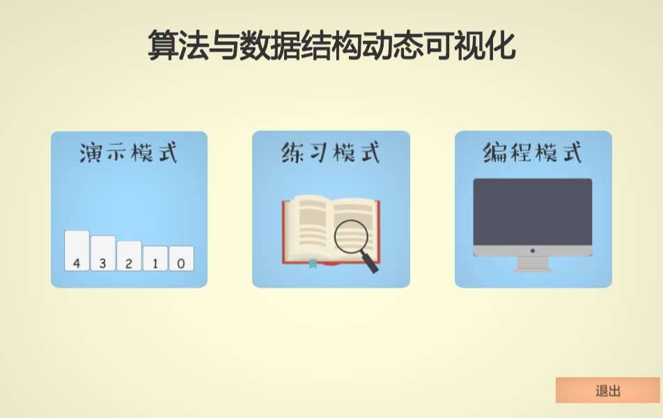
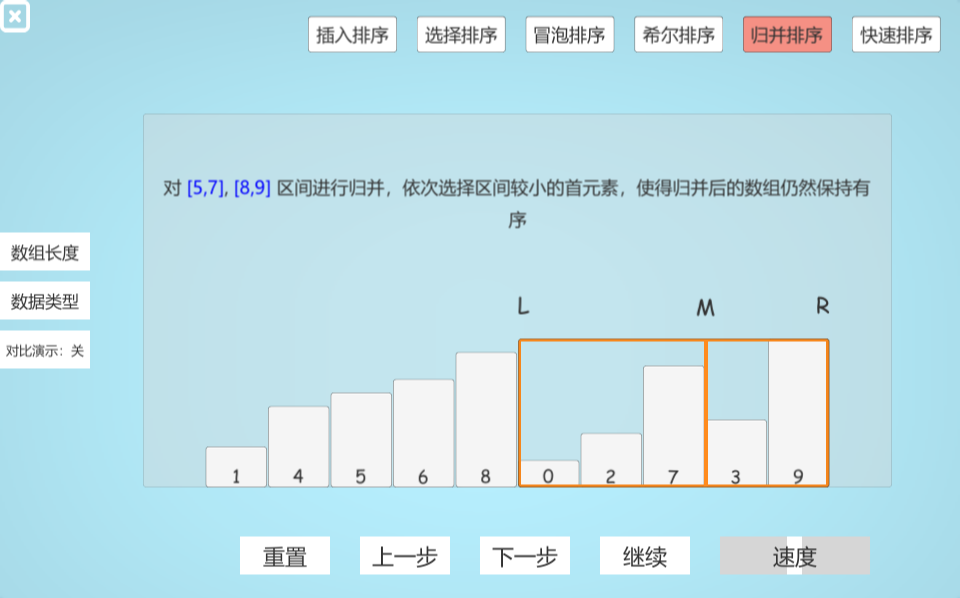
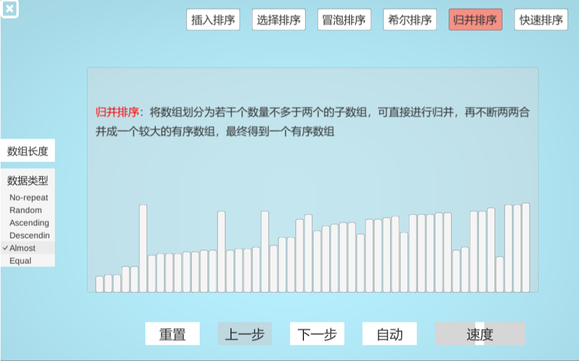
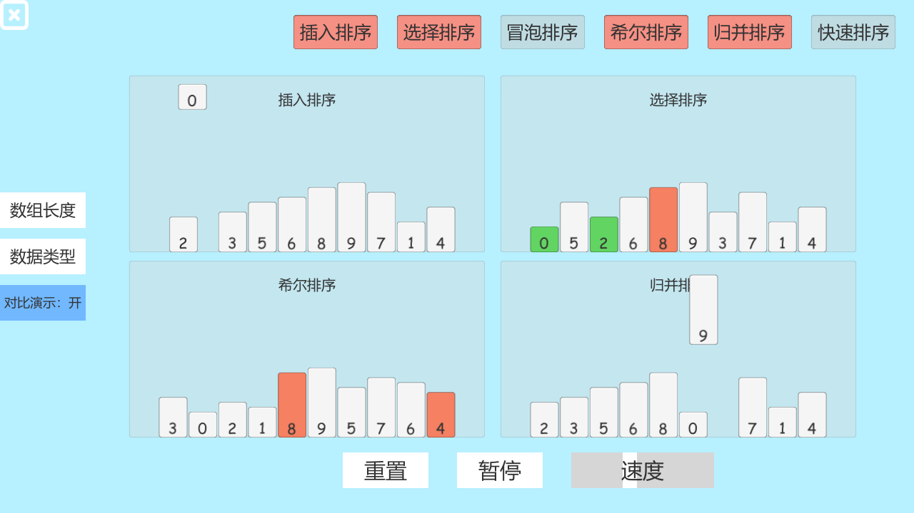
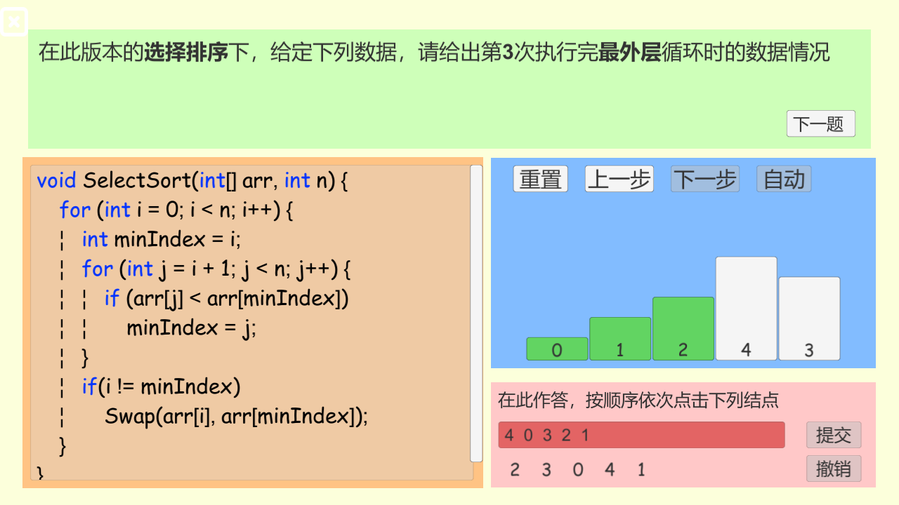
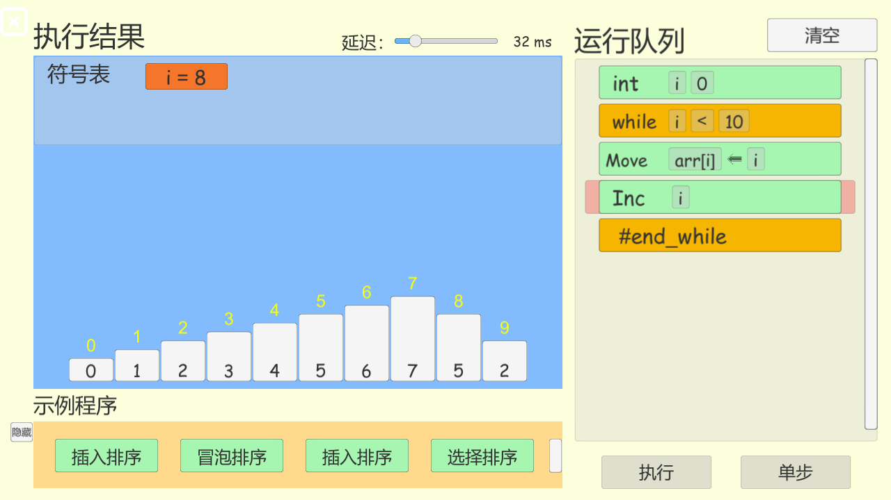
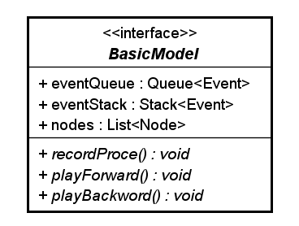
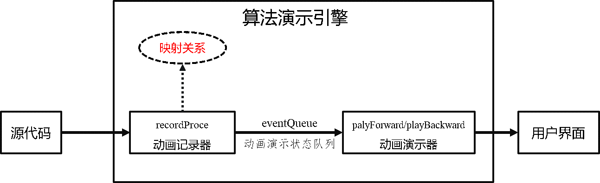
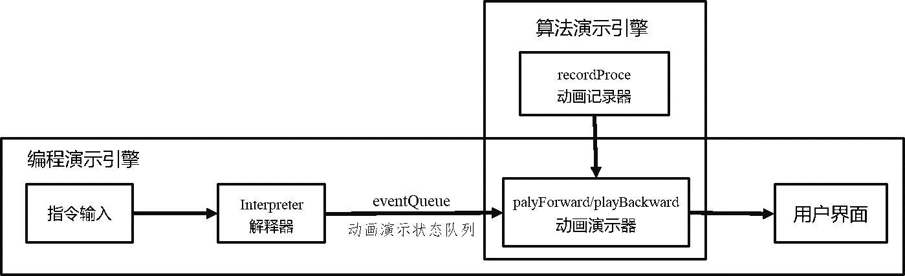
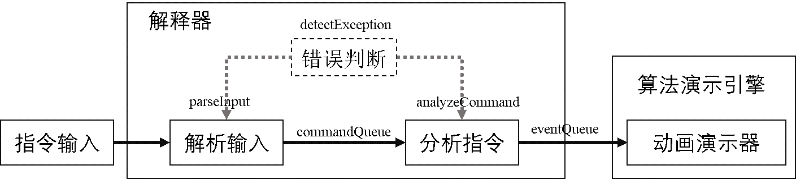

# Data structure & algorithms visualizer
线上演示地址：[Unity WebGL Player | Data Structure And Algorithms Visualizer (zichengcao.github.io)](https://zichengcao.github.io/algorithms-visualizer/)

使用 unity 实现的常见数据结构与算法可视化系统，支持常见的算法与数据结构：

具体而言支持的演示功能：

- 排序算法【冒泡排序，选择排序，插入排序，希尔排序，快速排序，归并排序】
  - 支持单步（**正向与反向**）、自动演示、动画速度调节
  - 支持设定数组长度、数据类型
  - 支持多种算法同步对比

- 搜索算法【线性查找，二分查找】
  - 支持单步（**正向与反向**）、自动演示、动画速度调节
  - 支持设定数组长度
- 链表【单链表，双向链表】
  - 支持单步、自动、**代码同步**演示
  - 支持头插、尾插、搜索、删除结点
  - 支持动态输入创建链表
- 栈 / 队列【链式栈，数组栈】
  - 支持单步、自动、**代码同步**演示
  - 支持入栈、出栈 / 入队、出队
  - 支持动态输入创建栈、队列
- 二叉树【普通二叉树、二叉排序树】
  - 支持单步、自动、**代码同步**演示
  - 支持二叉树的先序、中序、后序遍历
  - 支持二叉搜索树的查找、插入、删除结点

**练习模式**：提供排序算法的练习测试功能，测试对于算法的掌握程度，在预设定的框架下进行随机出题，用户进行作答，系统判断正误，并演示题目所描述的算法过程。

**编程模式**：基于数组的用户自定义算法演示功能，设计了一种类似汇编指令的特殊编程方式，具有相应的规范，接收用户输入的指令序列，系统对指令序列逐句进行解释，对执行结果进行展示。语法参见 `软件使用帮助.CHM`

## 运行实例

### 主界面

### 演示模式

以排序算法为例展示界面

**示例**：设定数组长度、数据类型

**示例**：多算法对比

### 练习模式

### 编程模式

**示例**：将 0~9 依次赋值给数组

## 系统设计

### 算法演示引擎设计

BasicModel 是算法（数据结构同理）演示引擎接口，声明了算法演示功能所必须实现的三个方法和成员

- nodes：结点接口，具有子类 ArrayNode，LinkedNode 等
- Event：定义为一个算法演示动作（代码与动画演示状态之间的映射关系），例如，在排序算法中很常见的交换两个结点的操作，对应动画为两个结点相互移动到对方位置。
- eventQueue：算法（正向）演示队列
- eventStack：算法（逆向）演示队列
- `playForward()`：正向演示一步
- `playBackward()`：逆向演示一步
- `recordProce()`：生成算法演示步骤，赋值给 eventQueue 

当用户选择一个算法开始演示时，系统内部会执行 recordProce方法，相当于模拟执行一遍算法，并将所有算法演示动作都存储在队列 eventQueue 中。

- 正向演示时，依次取出 eventQueue 队首的 event，判断具体的 event，执行相应的动画操作，同时将出队的 event 存入 eventStack 中；
- 逆向演示时，依次弹出 eventStack 栈顶的 event，并将 event 的参数相应“取反”，例如：MoveEvent 表示移动一个结点，正向演示时存储的移动方向是左，在逆向演示时，则应该向右移动。

### 编程演示引擎设计

编程演示引擎设计了一组类似汇编指令的特殊编程方式，实现了一个用于翻译指令的解释器，指令表如下：

| 名称          | 使用示例           | 含义                   |
| ------------- | ------------------ | ---------------------- |
| int           | int a 2            | 定义值为2的int变量     |
| move          | move a b           | 赋值语句，将b赋值给a   |
| swap          | swap arr[i] arr[j] | 交换数组的第i与j个元素 |
| if & else     | if expression      | 分支语句               |
| while & break | while expression   | 循环语句               |
| inc           | inc a              | 自增语句，a = a+1      |
| dec           | dec a              | 自减语句，a = a-1      |

符合一般编程常识，例如：

- 索引从 0 开始
- 标识符不应该由数字开头
- ……

实现自动将用户输入的指令序列解释成动画演示状态，调用算法演示引擎提供的动画演示接口进行演示：

解释器模型如下，首先，对用户输入的指令序列进行解析；然后，对解析得到的 commandQueue 进行分析，得到一组动画演示动作 存入 eventQueue；最后，送入算法演示引擎部分的动画演示器进行演示。

错误判断则贯穿在解析输入（词法错误）和分析指令（语法错误）的整个执行过程。

